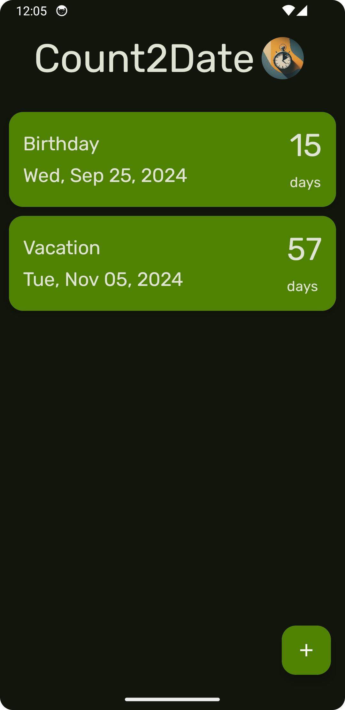
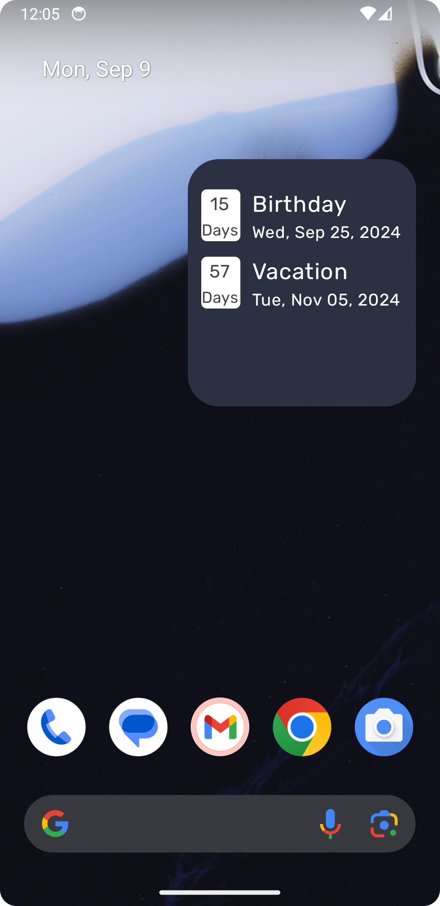
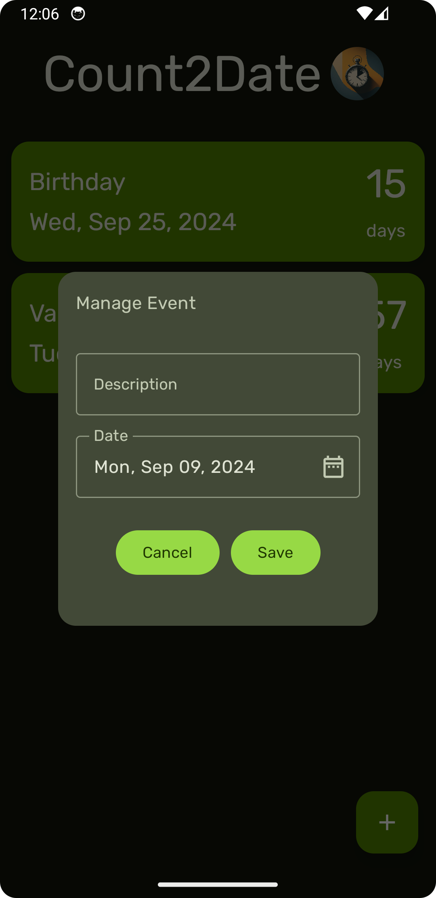

# Count2Date

A simple open-source android mobile application with widget for counting down the days.

## Technologies
- 100% Kotlin.
- Made Using Jetpack Compose.
- Following Clean Architecture approach.
- Following MVVM Architectural Design Pattern.

### Used in the app :
- Room DB
- Hilt
- Kotlin coroutines
- Kotlin Flows
- Jetpack Compose

## License

This project is licensed under the MIT License.

## References
[Slide to Delete](https://www.geeksforgeeks.org/android-jetpack-compose-swipe-to-dismiss-with-material-3/)